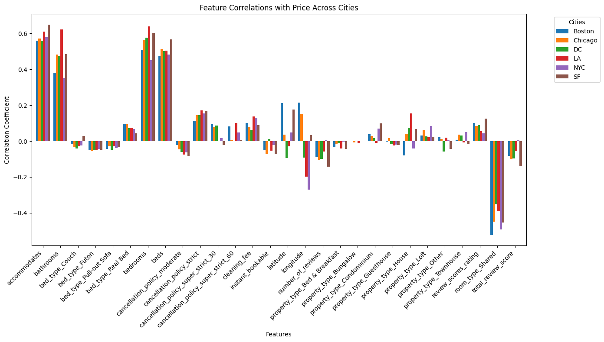
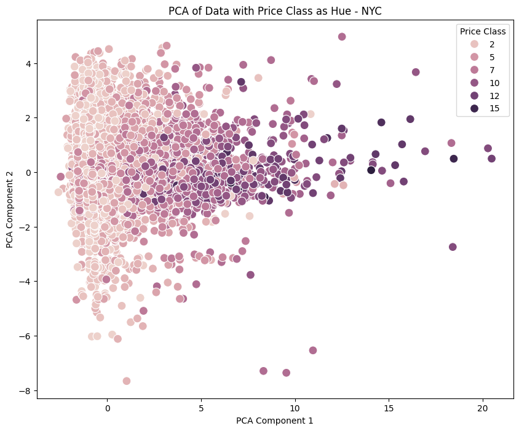
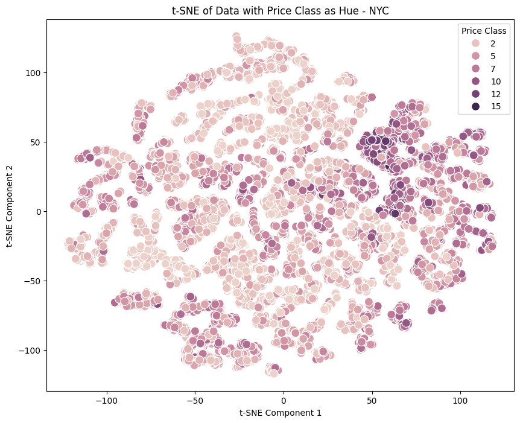
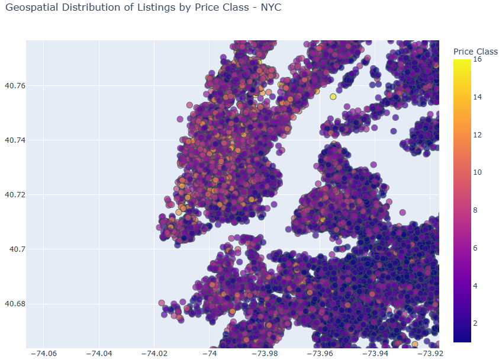

# **Airbnb Price Prediction Project**

## **Overview**
This project explores Airbnb listing prices in six major U.S. cities: New York City, Los Angeles, San Francisco, Washington DC, Boston, and Chicago. Using the dataset provided on [Kaggle](https://www.kaggle.com/datasets/stevezhenghp/airbnb-price-prediction), the goal is to help prospective Airbnb hosts determine competitive pricing for their properties.

The general approach includes:
- **Data Cleaning**: Removing irrelevant or redundant features and handling missing data.
- **Exploratory Data Analysis (EDA)**:
  - Investigating feature correlations with price.
  - Applying dimensionality reduction (PCA, t-SNE) to uncover patterns in high-dimensional data.
  - Analyzing the relationship between geospatial data (latitude/longitude) and price.
- **Feature Engineering**: Incorporating proximity to landmarks and transport hubs to enhance predictive power.
- **Machine Learning Solution**: Implementing regression and classification models to predict prices and classify listings into price tiers.
- **Results and Insights**: Highlighting key findings and providing actionable recommendations for Airbnb hosts.

---

## **Motivation**
Airbnb prices are highly dynamic and influenced by various factors like location, property type, and amenities. Hosts often struggle to set optimal prices, leading to underperformance or missed opportunities. This project addresses this issue by:
- **Providing insights** into the factors affecting Airbnb prices.
- **Helping hosts** set competitive rates to maximize earnings.
- Utilizing a comprehensive dataset to uncover patterns across multiple cities.

---

## **Data Preparation and Cleaning**
The dataset underwent the following steps for preparation:
1. **Feature Dropping**:
   - Irrelevant or low-impact columns such as `host_has_profile_pic`, `host_since`, and `thumbnail_url` were removed.
   - NLP-related columns (`description`, `name`, `amenities`) were excluded due to dimensionality issues.
   
2. **Feature Engineering**:
   - Consolidated `room_type` and `property_type` to reduce categorical diversity.
   - Calculated `review_duration` from `first_review` and `last_review`.
   
3. **Handling Missing Data**:
   - Missing values in key features were imputed based on averages or other logical defaults.
   
4. **Target Transformation**:
   - The target variable (`price`) was log-transformed to normalize its distribution.

---

## **[Exploratory Data Analysis (EDA)](./EDA.ipynb)**

1. **Feature Correlation Analysis**:
   - **Correlation Calculations with Price**: Revealed strong positive correlations between price and features such as `bedrooms` and `bathrooms`.
   - Highlighted city-specific variations in feature importance.
   
   

2. **Dimensionality Reduction**:
   - **PCA**: Reduced features into components capturing maximum variance, providing insights into data structure.
     - The plot below shows PCA components colored by `price_class`.
   
   

   - **t-SNE**: Highlighted clusters of listings with similar price classes.
     - The t-SNE plot reveals distinct clusters, particularly for higher price classes.

   

3. **Geospatial Analysis**:
   - Mapped listings across cities, using price class as hue.
   - Identified spatial clustering of high-price listings near central urban areas and landmarks.

   

---

## **Feature Engineering**

### **1. [Landmarks](./Feature_Engineering_Landmarks.ipynb)**
- **Description**:
  - Incorporated proximity to key landmarks, such as tourist attractions, parks, and other points of interest.
  - Engineered features:
    - `landmarks_within_500m`, `landmarks_within_1000m`, `landmarks_within_2000m`: Counts of landmarks within specified radii.
    - `shortest_distance_to_landmark`: Minimum distance to the nearest landmark.
  - Objective: To capture the influence of tourist appeal and urban centrality on Airbnb pricing.

---

### **2. [Metro](./Feature_Engineering_Metro.ipynb)** 
- **Description**:
  - Incorporated proximity to transportation hubs, such as metro stations and airports.
  - Engineered features:
    - `metro_within_500m`, `metro_within_1000m`, `metro_within_5000m`: Counts of metro stations within specified radii.
    - `shortest_distance_to_metro`: Minimum distance to the nearest metro station.
  - Objective: To quantify the impact of urban connectivity and convenience on Airbnb pricing.

---

## **[Machine Learning Solution](./ML_Solution.ipynb)**
1. **Models Implemented**:
   - **Linear Regression**: Baseline model for price prediction.
   - **XGBoost Regressor**: Utilized gradient boosting to handle non-linear relationships and feature interactions.
   - **Random Forest Regressor**: Captured non-linear relationships between features and price effectively.

2. **Metrics**:
   - **Regression Models**: 
     - Root Mean Squared Error (RMSE).
     - R² Score (Explained Variance).
   - **Model Comparison**:
     - Evaluated performance on both clean and engineered datasets.

---

## **Results and Insights**
1. **Key Findings**:
   - Features such as `bedrooms`, `bathrooms`, `review_scores_rating`, and geospatial features significantly impact pricing.
   - Proximity to landmarks and transport hubs adds predictive value, with minor improvements in R² score and RMSE.

2. **Model Performance**:
   - Best-performing model: **XGBoost Regressor** with:
     - R² Score = `0.666` (engineered features dataset).
     - RMSE = `77.57`.

3. **Recommendations**:
   - **For Hosts**:
     - Highlight location advantages (e.g., proximity to landmarks or transport hubs) in their listings to justify pricing.
     - Focus on property features like additional bedrooms or bathrooms, as they significantly increase listing value.
   - **For Future Analysis**:
     - Incorporate more temporal and dynamic features (e.g., seasonality, daily demand fluctuations).
     - Explore additional external data (e.g., neighborhood demographics, local events) for richer predictions.

---

## **Conclusion**
This project demonstrated the importance of both property-specific features and geospatial data in predicting Airbnb prices. While baseline models provided reasonable accuracy, incorporating engineered features like proximity to landmarks and transport hubs marginally improved predictive power. Further exploration of additional datasets and model fine-tuning could lead to even better results.

## **Individual Contributions**
- **Member 1: Toh Jun Meng**:  
  - Completed EDA
  - Contributed to ML solution
  - Contributed Feature Engineering: Landmarks
  - Contributed Feature Engineering: Metro
  - Contributed to github and slides

- **Member 2: Low Kan Yui**:  
  - Contributed Feature Engineering: Landmarks
  - Contributed to github and slides

- **Member 3: Natanael Tan Tiong Oon**:  
  - Contributed Feature Engineering: Metro
  - Contributed to ML solution
  - Contributed to github and slides

## **References**

### **Datasets**
1. **Kaggle Airbnb Dataset**  
   [Link to Dataset on Kaggle](<https://www.kaggle.com/datasets/stevezhenghp/airbnb-price-prediction>)

2. **Landmark Data Sources**:
   - **Chicago Landmarks**: [List of Chicago Landmarks](https://en.wikipedia.org/wiki/List_of_Chicago_Landmarks)
   - **New York City Historic Landmarks**: [List of National Historic Landmarks in New York City](https://en.wikipedia.org/wiki/List_of_National_Historic_Landmarks_in_New_York_City)
   - **Los Angeles County Historical Landmarks**: [California Historical Landmarks in Los Angeles County](https://en.wikipedia.org/wiki/California_Historical_Landmarks_in_Los_Angeles_County)
   - **San Francisco Designated Landmarks**: [List of San Francisco Designated Landmarks](https://en.wikipedia.org/wiki/List_of_San_Francisco_Designated_Landmarks)
   - **Washington, D.C. Historic Landmarks**: [List of National Historic Landmarks in Washington, D.C.](https://en.wikipedia.org/wiki/List_of_National_Historic_Landmarks_in_Washington,_D.C)
   - **Boston Historic Landmarks**: [List of National Historic Landmarks in Boston](https://en.wikipedia.org/wiki/List_of_National_Historic_Landmarks_in_Boston)

### **Libraries and Tools**
3. **Python Libraries**:
   - [scikit-learn](https://scikit-learn.org/stable/): For machine learning and model evaluation.
   - [XGBoost](https://xgboost.readthedocs.io/): Gradient boosting for regression.
   - [pandas](https://pandas.pydata.org/): For data manipulation and analysis.
   - [NumPy](https://numpy.org/): For numerical computations.
   - [t-SNE](https://scikit-learn.org/stable/modules/generated/sklearn.manifold.TSNE.html): Dimensionality reduction.

4. **Visualization Tools**:
   - [Matplotlib](https://matplotlib.org/): For static visualizations.
   - [Seaborn](https://seaborn.pydata.org/): For statistical data visualizations.

## **For More Information**
- For detailed project requirements, please refer to the [Project Requirements](./proj_req.md).
- For video presentation guidelines, please refer to the [Video Presentation Guidelines](./video_req.md).
